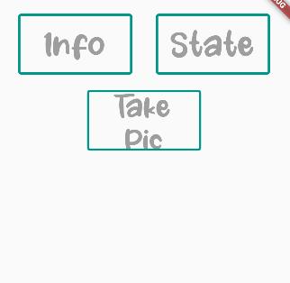
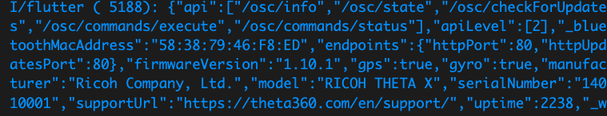

# THETA X Mobile App

I used http requests to get the info output when the info button is pressed. The app will connect to the Ricoh THETA X camera and fetch the info data from it. I also added a state button and a take picture button. 

## List of API Commands

* [info](https://api.ricoh/docs/theta-web-api-v2.1/protocols/info/)
* [state](https://api.ricoh/docs/theta-web-api-v2.1/protocols/state/)
* [execute](https://api.ricoh/docs/theta-web-api-v2.1/protocols/commands_execute/)

## HTTP Network

This app uses the [http](https://pub.dev/packages/http) package in order to retrieve commands from the THETA camera. 

## State Management

This app does NOT use state management; the response is printed in the debug console.

