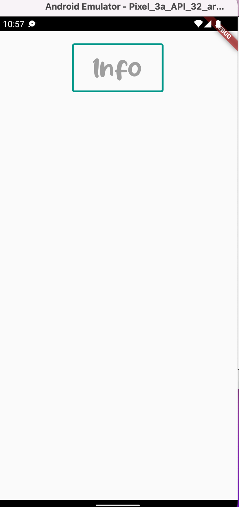

# THETA X Info

Ayu Light theme with info output when button is pressed. The app will connect to Ricoh THETA X camera and fetch the info data from it. [Ricoh THETA X Info](https://api.ricoh/docs/theta-web-api-v2.1/protocols/info/)

